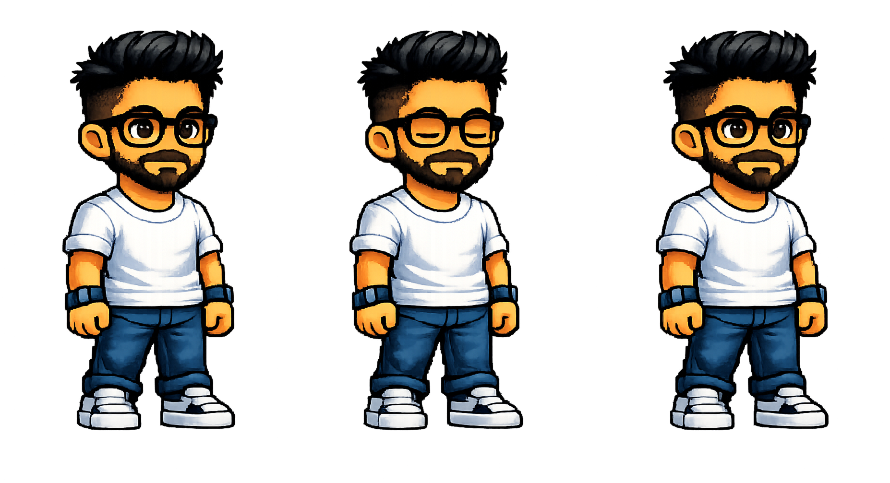
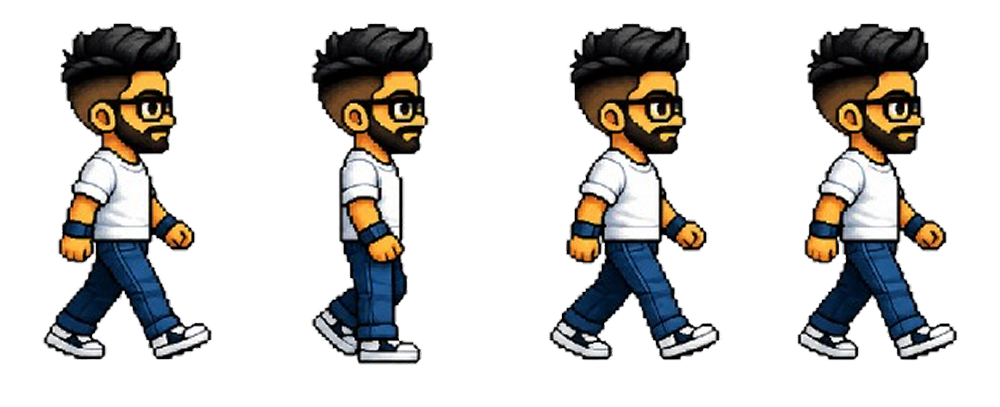
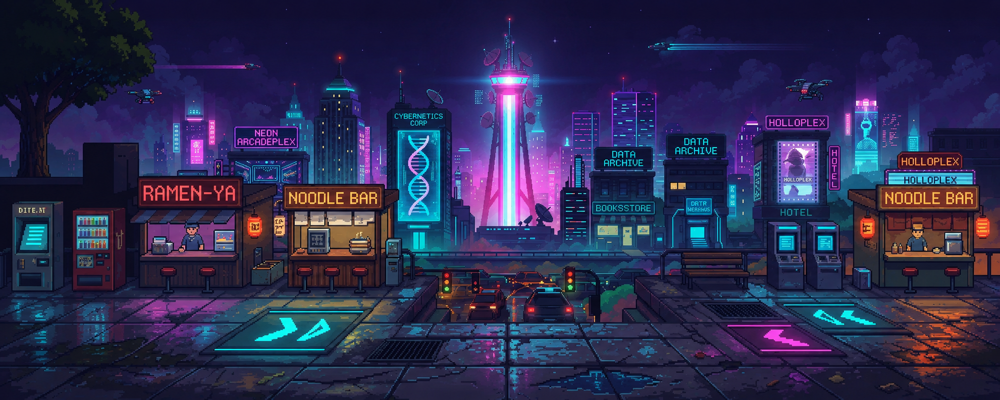
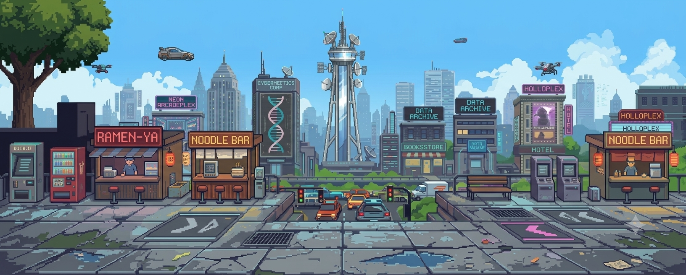

# 🎮 Portfolio

Um portfólio interativo desenvolvido com **HTML, CSS e JavaScript**, inspirado em jogos retrô de plataforma e pixel art.

Em vez de uma navegação tradicional, o visitante acompanha um personagem que percorre diferentes cenários enquanto apresenta informações, projetos, habilidades e experiências de forma dinâmica.

---

## ✨ Demonstração

> PERSONAGEM




> CENÁRIO



---

## 🚀 Funcionalidades

* 🎮 Personagem com animação de caminhada
* 🕹️ Navegação baseada em scroll
* 📍 Sistema de paradas em cada seção
* 🎨 Troca automática de sprites durante a movimentação
* 🌄 Cenários em pixel art
* ⚡ Carregamento otimizado das seções com `IntersectionObserver`
* 📱 Layout responsivo
* 🌐 Suporte para múltiplos idiomas
* ✨ Animações suaves utilizando CSS e JavaScript

---

## 🛠 Tecnologias

* HTML5
* CSS3
* JavaScript (ES6+)
* Intersection Observer API
* Responsive Design

---

## 🎯 Objetivo

O projeto foi criado para transformar um portfólio tradicional em uma experiência interativa, aproximando conceitos de desenvolvimento web e design de jogos.

Cada seção representa uma etapa da jornada do personagem, tornando a navegação mais envolvente e intuitiva.

---

## 📸 Galeria

### Tela Inicial

> Adicione uma imagem.

### Seção Sobre

> Adicione uma imagem.

### Projetos

> Adicione uma imagem.

### Habilidades

> Adicione uma imagem.

---

## ⚙️ Como executar

Clone o repositório:

```bash
git clone https://github.com/seu-usuario/seu-repositorio.git
```

Entre na pasta:

```bash
cd seu-repositorio
```

Abra o arquivo `index.html` em seu navegador.

> Como o projeto é totalmente desenvolvido com HTML, CSS e JavaScript puro, não é necessário instalar dependências.

---


## 📄 Licença

Este projeto está disponível para fins de estudo, inspiração e demonstração de desenvolvimento front-end.
